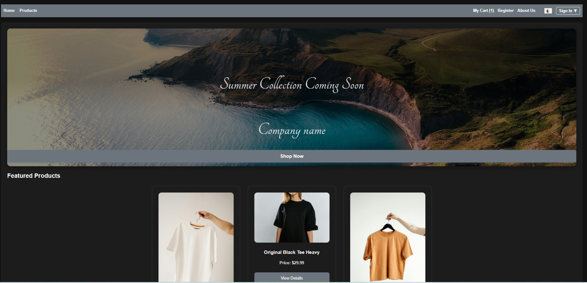

# Ecommerce-demo  
Custom Web Design Solutions



---
## About  
This project is a clean, professional website template crafted for a web development agency or freelance team. It showcases our ability to deliver custom, responsive websites—from concept to deployment. The goal is to provide a polished, contemporary presence for prospective clients seeking tailored web design solutions.

---

## Features  
- Responsive design for desktop, tablet, and mobile  
- Clean, semantic HTML  
- Modern CSS layout techniques (Flexbox/Grid)  
- Interactive JavaScript components  

---

## Running Locally  
No backend needed. Simply clone the repo and open `index.html` in your browser:

```bash
git clone https://github.com/Mreigel/ecommerce-demo
cd ecommerce-demo
# open index.html in your browser
```

---

## Key Principles Learned

- **Responsive Design:** Using CSS media queries and flexible layouts to ensure the site adapts seamlessly to different screen sizes and devices.  
- **Semantic HTML:** Structuring HTML elements meaningfully to improve accessibility, SEO, and maintainability.  
- **Modern CSS Layouts:** Applying Flexbox and CSS Grid to create clean, flexible, and efficient layouts without relying on floats or positioning hacks.  
- **JavaScript Interactivity:** Implementing dynamic UI components with vanilla JavaScript to enhance user experience without heavy dependencies.  

---

## Contact  

**Michael Reigel**  
[LinkedIn](https://www.linkedin.com/in/mreigel/)  
[GitHub](https://github.com/Mreigel)

**Joe Lima**  
[LinkedIn](https://www.linkedin.com/in/joe-lima/)  
[GitHub](https://github.com/jlima9001)
